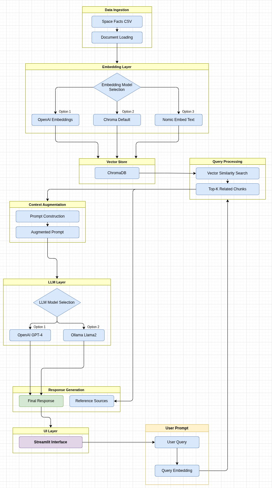
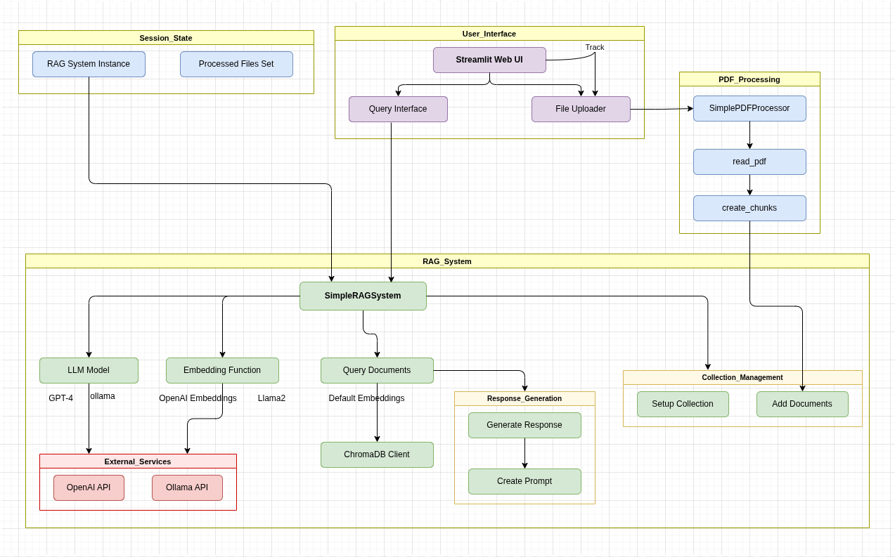

# 🧠 DocuMind

> **Chat with your PDF documents using AI.** Upload any PDF, ask questions in plain English, and get accurate answers grounded in your document — powered by RAG, ChromaDB, and your choice of LLM.

A Retrieval-Augmented Generation (RAG) application focused on PDF document intelligence, with a Streamlit UI and swappable LLM/embedding backends.

---

## Pipeline Overview



DocuMind processes your PDF through five stages:

1. **Data Ingestion** — Upload and parse PDF pages into raw text
2. **Embedding Layer** — Encode documents into vectors using your chosen model (OpenAI / Chroma Default / Nomic)
3. **Vector Store** — Persist embeddings in ChromaDB for fast similarity search
4. **Query Processing** — Embed the user query, retrieve top-K relevant chunks
5. **LLM Layer → Response Generation** — Augment the query with retrieved context, send to LLM, return answer + source references

---

## Architecture



DocuMind's `SimplePDFProcessor` reads each page with PyPDF2, splits text into overlapping chunks (1000 chars / 200 overlap), and stores them in a per-embedding-model ChromaDB collection tracked across Streamlit `session_state`. Switching embedding models automatically resets the collection to prevent dimension mismatches.

---

## Project Structure

```
DocuMind/
├── rag_pdf_simple.py      # 🎯 Main app — PDF upload, Q&A, persistent ChromaDB
├── rag_streamlit.py       # Streamlit app — CSV demo (space facts)
├── simple_rag.py          # CLI pipeline — CSV data, interactive model selection
├── space_facts.csv        # Auto-generated sample data
└── chroma_db/             # Persisted vector store
```

---

## Supported Models

| Component | Options |
|-----------|---------|
| **LLM** | OpenAI GPT-4o-mini · Ollama Llama 3.2 |
| **Embeddings** | OpenAI `text-embedding-3-small` (1536-d) · Chroma Default (384-d) · Nomic Embed Text via Ollama (768-d) |
| **Vector Store** | ChromaDB (in-memory or persistent) |

---

## Quickstart

### 1. Install dependencies

```bash
pip install streamlit chromadb openai python-dotenv PyPDF2 pandas
```

For local models (optional):
```bash
# Install Ollama, then pull models
ollama pull llama3.2
ollama pull nomic-embed-text
```

### 2. Set up environment

```bash
echo "OPENAI_API_KEY=sk-..." > .env
```

### 3. Run DocuMind

```bash
# 🎯 Main app — PDF chat
streamlit run rag_pdf_simple.py

# CSV demo
streamlit run rag_streamlit.py

# CLI pipeline
python simple_rag.py
```

---

## How DocuMind Works

```
User Query
   │
   ▼
Query Embedding  ──►  ChromaDB similarity search  ──►  Top-K chunks
                                                            │
                                                            ▼
                                              Augmented Prompt (context + query)
                                                            │
                                                            ▼
                                                    LLM → Final Answer
```

The prompt template keeps the LLM grounded:

```
Context: <retrieved chunks>

Question: <user query>
Answer:
```

If the answer isn't in the context, the model is instructed to say so.

---

## Key Design Decisions

- **Chunking with overlap** — 200-char overlap prevents answers from being split across chunk boundaries
- **Per-model collections** — ChromaDB uses separate collections per embedding model to avoid dimension mismatches when switching models
- **Session state management** — Streamlit resets processed files and reinitialises the RAG system when the embedding model changes
- **Dual LLM backend** — OpenAI and Ollama share the same OpenAI-compatible client interface, making swapping trivial

---

## Requirements

```
streamlit
chromadb
openai
python-dotenv
PyPDF2
pandas
```

---
